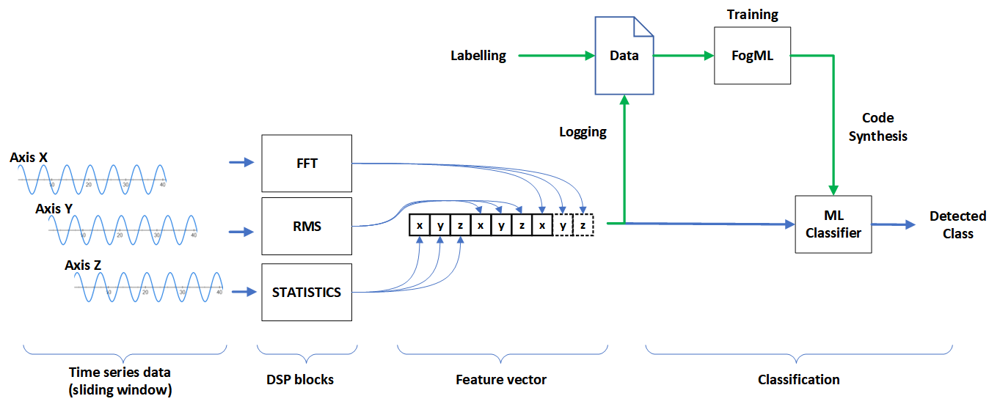

# FogML-Zephyr

Example of anomaly detection and classification algorithms provided by the FogML project. It uses:
* FogML-SDK [https://github.com/tszydlo/fogml_sdk]
* FogML tools [https://github.com/tszydlo/FogML]

## Classification



```
@inproceedings{FogMLSzydlo2018,
  author    = {Tomasz Szydlo and
               Joanna Sendorek and
               Robert Brzoza{-}Woch},
  editor    = {Yong Shi and
               Haohuan Fu and
               Yingjie Tian and
               Valeria V. Krzhizhanovskaya and
               Michael Harold Lees and
               Jack J. Dongarra and
               Peter M. A. Sloot},
  title     = {Enabling Machine Learning on Resource Constrained Devices by Source
               Code Generation of the Learned Models},
  booktitle = {Computational Science - {ICCS} 2018 - 18th International Conference,
               Wuxi, China, June 11-13, 2018, Proceedings, Part {II}},
  series    = {Lecture Notes in Computer Science},
  volume    = {10861},
  pages     = {682--694},
  publisher = {Springer},
  year      = {2018},
}
```
